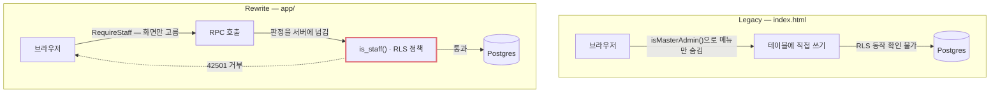
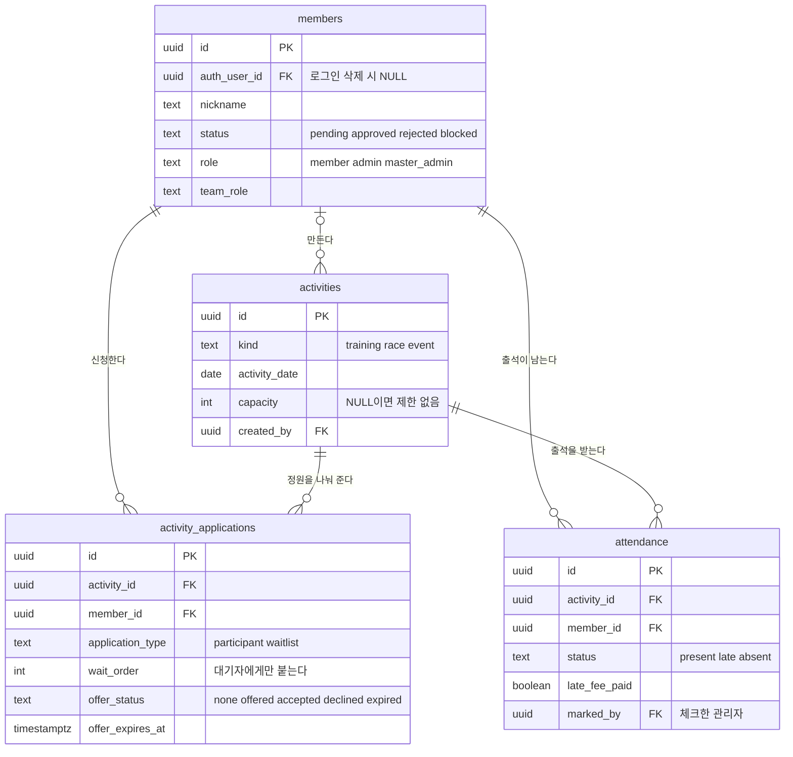
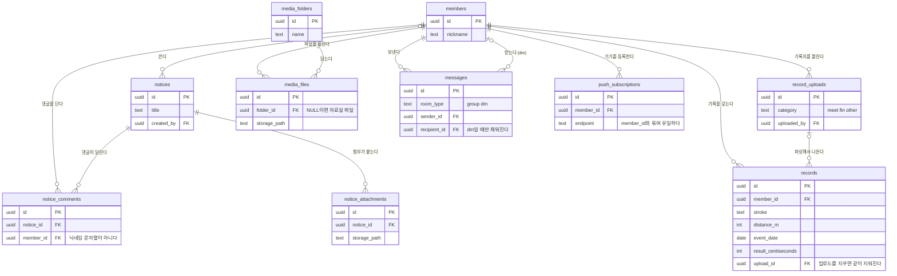
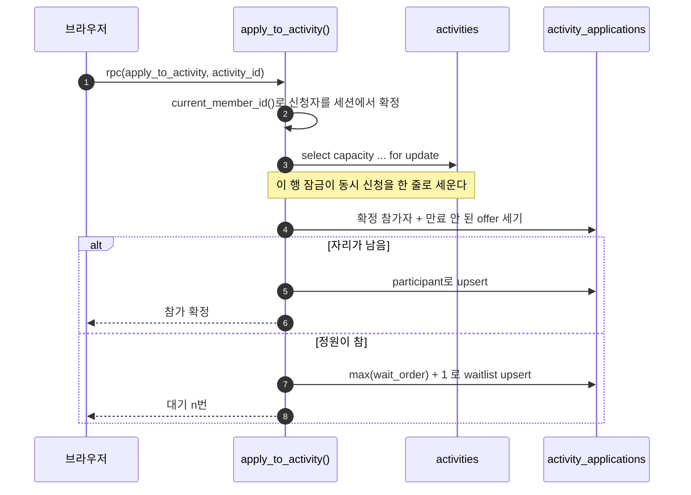

# TEAM EYSL

수영 동호회 TEAM EYSL의 회원 관리 앱입니다. 이 저장소에는 두 가지가 함께 있습니다.

- **`index.html`** — 현재 회원들이 쓰고 있는 앱. 단일 파일이며 손대지 않습니다.
- **`app/`** — 다시 만들고 있는 앱. TypeScript, 서버가 권한을 갖는 구조.

## Why rebuild

기존 앱의 문제는 코드가 지저분해서가 아니라 **브라우저가 진실의 원천**이기 때문입니다. 정원이 남았는지, 출석을 체크했는지, 관리자가 맞는지를 전부 사용자 기기에서 판단하고 결과만 서버에 보냅니다.

그래서 이런 일이 실제로 벌어지고 있습니다.

| 증상 | 원인 |
|---|---|
| 관리자가 체크한 출석이 새로고침하면 사라짐 | 저장 코드가 아예 없음. 메모리 변수만 바뀜 |
| 두 사람이 동시에 단 공지 댓글 중 하나가 없어짐 | 댓글 배열 전체를 낡은 사본으로 덮어씀 |
| 훈련 신청이 정원을 넘거나 대기번호가 겹칠 수 있음 | 브라우저가 캐시된 인원수로 자리를 배정 |
| "자동으로 다음 대기자에게 넘어갑니다"가 실제로는 안 넘어감 | 화면에 안내만 있고 승계 코드가 없음 |

재구축은 이 판정들을 서버로 옮깁니다. 자세한 결함 목록은 `CLAUDE.md`에 있습니다.

## Where authority lives

말로 설명하면 비슷하게 들리는 두 경로입니다. 나란히 놓으면 어디가 다른지 보입니다.



위쪽에서는 판정이 브라우저 안에서 끝납니다. `isMasterAdmin()`을 지나고 나면 남은 건 평범한 테이블 쓰기라서, 개발자 도구를 열 줄 아는 사람에게는 잠금장치가 아닙니다. 아래쪽에서 브라우저가 하는 일은 화면을 고르는 것뿐이고, 실제로 거절할 수 있는 지점은 굵게 표시한 한 곳입니다.

레거시의 마지막 화살표에 "저장됨"이라고 적지 않은 이유가 있습니다. 회장님 프로젝트의 RLS가 무엇을 막고 있는지 우리는 확인할 수 없습니다. 잘 막고 있을 수도 있습니다. 다만 앱 코드만 봐서는 알 수 없고, 남의 운영 시스템에 권한 시험을 해볼 생각은 없습니다.

**라우트 트리의 위치가 무엇을 보여줄지 결정합니다.** 로그인이 필요한 화면은 `RequireAuth` 아래, 관리자 화면은 `RequireStaff` 아래, 승인·권한처럼 총관리자만 만지는 화면은 그 안쪽 `RequireMasterAdmin` 아래에 놓입니다. 기존 앱은 관리자 화면 여섯 개 중 두 개만 역할을 확인했습니다.

**단, 가드가 답을 낼 수 없는 경우도 있습니다.** 일정 생성이 그렇습니다. 마이그레이션 0015가 "기타" 일정을 모든 회원에게 열어준 뒤로, 누가 쓸 수 있는지는 일정의 종류와 누가 올렸는지에 달렸습니다. 트리의 어느 위치도 그 문장을 말할 수 없어서 RLS 정책 네 개가 대신 말합니다. 가드를 하나 더 얹으면 결정하는 척하는 가드가 하나 늘 뿐입니다.

**쓰기는 전부 서버 함수를 거칩니다.** `attendance` 테이블은 RLS가 켜져 있고 정책이 하나도 없으며 권한도 회수돼 있어서, 오직 `attendance_mark_v1()` 같은 함수로만 접근할 수 있습니다. 그 함수가 호출자가 관리자인지 서버에서 확인합니다.

## Data model

스키마는 `app/supabase/migrations/`에 있고, 아래 두 그림은 그중 테이블을 만드는 0001과 0004를 옮긴 것입니다. 의미를 나르는 열만 골라 적었습니다.

사람과 일정이 만나는 곳입니다. 출석과 신청은 둘 다 `(activity_id, member_id)`로 유일합니다.



나머지는 회원을 축으로 붙는 콘텐츠입니다. 댓글은 작성자를 `member_id`로 가리키고 닉네임을 복사하지 않습니다. 기존 앱이 댓글을 공지 안 jsonb 배열에 통째로 넣어 서로 덮어쓰던 자리입니다.



## How a training application is decided

정원 초과와 대기번호 충돌은 브라우저가 자리를 세었기 때문에 생깁니다. `apply_to_activity()`는 그 계산을 통째로 데이터베이스 안으로 옮기고, 세기 전에 일정 행을 잠급니다.



`for update`가 이 그림의 전부입니다. 잠금을 잡은 신청이 자기 자리를 넣고 커밋할 때까지 다음 신청은 3번 줄에서 기다리므로, 두 사람이 같은 마지막 자리를 가져가거나 같은 대기번호를 받을 수 없습니다. 신청자 id는 브라우저가 보내는 게 아니라 세션에서 꺼내므로 남의 이름으로 신청할 필드 자체가 없습니다.

세는 대상에는 확정 참가자뿐 아니라 아직 살아 있는 대기 승계 제안(`offer_status = 'offered'`)도 들어갑니다. 자리를 주겠다고 해놓고 그 자리를 남에게 내주면 제안받은 사람은 시간 안에 수락해도 실패합니다. 만료된 제안은 승계 스윕이 아직 안 돌았더라도 그 순간부터 자리를 차지하지 않습니다.

## Architecture

```
index.html              현재 서비스 중인 앱 (동결)
sw.js, manifest.*       현재 앱의 PWA 파일 (동결)
app/                    재구축
├─ src/
│  ├─ app/              라우터와 가드
│  ├─ features/         기능별 모듈 (auth, schedule, attendance, notices, records, media, members, chat, push…)
│  ├─ lib/              supabase 클라이언트, 환경변수, 쿼리 클라이언트
│  └─ types/            DB에서 생성한 타입 (커밋됨)
├─ supabase/migrations/ 순서대로 적용되는 SQL
└─ scripts/             psql, 마이그레이션, 타입 생성
```

## Getting started

Node 24, npm 11, `psql`이 필요합니다. Supabase CLI는 없어도 됩니다.

```bash
cp .env.example .env          # DB 접속 정보 — scripts/가 읽습니다
# .env의 VITE_* 두 줄을 app/.env 로도 복사하세요.
# Vite는 실행 디렉터리의 .env만 읽으므로 두 파일이 필요합니다.

cd app
npm install
npm run db:migrate            # supabase/migrations/*.sql 을 순서대로 적용
npm run db:types              # 스키마에서 TypeScript 타입 생성 (Docker 필요)
npm run dev
```

| 명령 | 하는 일 |
|---|---|
| `npm run dev` | 개발 서버 |
| `npm run build` | 타입 검사 후 빌드 |
| `npm run typecheck` | 타입 검사만 |
| `npm test` | Vitest |
| `npm run db:migrate` | 아직 적용되지 않은 마이그레이션만 실행 |
| `npm run db:psql -- -c "select 1"` | dev DB에 일회성 쿼리 |
| `npm run db:types` | `src/types/database.ts` 재생성 |

마이그레이션과 그 적용 기록은 **같은 트랜잭션**에서 커밋됩니다. 실패하면 절반만 적용된 스키마도, 성공했다고 주장하는 기록도 남지 않습니다.

## This repository is public

키·토큰·`.env`를 커밋하면 그 즉시 노출됩니다. `.gitignore`가 막고 `.github/workflows/guard.yml`이 CI에서 다시 확인합니다.

**개발 빌드가 운영 DB를 향하지 않도록 두 겹으로 막아뒀습니다.** CI는 운영 프로젝트 식별자가 동결된 `index.html` 밖에 나타나면 실패시키고, `app/src/lib/env.ts`는 실행 시점에 그 주소를 거부합니다. 배포 환경변수를 잘못 넣어도 앱이 뜨지 않습니다 — 빈 화면은 되돌릴 수 있지만 망가진 회원 데이터는 그렇지 않습니다.

## How we work

`dev`에서 브랜치를 따고 PR로 병합합니다. `main`은 원본과 맞추는 용도라 직접 건드리지 않습니다.

같은 분류를 브랜치와 커밋에 씁니다. 브랜치는 슬래시(`feat/attendance-fix`), 커밋과 PR 제목은 콜론(`feat: ...`)입니다. 콜론은 git 브랜치 이름에 쓸 수 없습니다.

분류: `feat` `fix` `docs` `chore` `refactor` `test`

PR을 올리면 codex로 셀프 리뷰하고, 발견 사항을 한국어 코멘트로 남긴 뒤, critical과 high를 모두 고치고 병합합니다. 그 리뷰가 실제로 값을 했습니다 — 익명 사용자가 실행할 수 있는 함수와 익명이 쓸 수 있는 마이그레이션 원장을 잡아냈습니다. 그래서 규칙이 하나 늘었습니다.

> 발견된 방식과 같은 방식으로 검증되기 전까지 수정은 수정이 아니다.

자세한 규약은 `CLAUDE.md`를 보세요.

## Not built yet

- **회비** — 지금은 구글 시트에만 있습니다. 회비가 모두 같은 금액인지, 부분 납부를 기록해야 하는지 정해지기 전에는 만들지 않습니다. 추측해서 만들면 나중에 다시 뜯게 됩니다.
- **푸시 발송** — 기기를 등록하고 구독을 저장하는 쪽은 됩니다. 보내는 쪽이 없습니다. VAPID 개인 키를 들고 있을 서버가 필요한데 아직 없어서, 알림 설정 화면이 그 사실을 화면에 적어둡니다. 켜놓고 아무것도 안 오는 것보다는 낫습니다.
- **운영 환경** — 아직 dev 프로젝트 하나로만 작업합니다. 운영은 회장님 프로젝트이고 우리에게 접근 권한이 없습니다.
